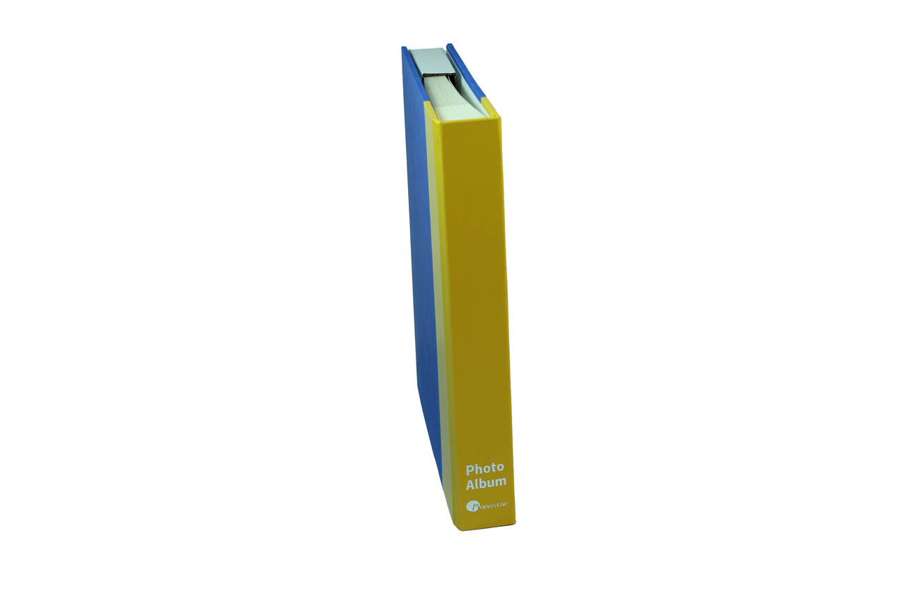
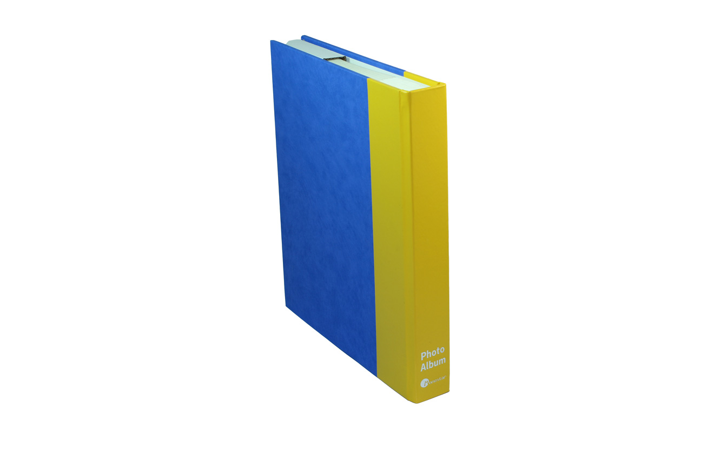
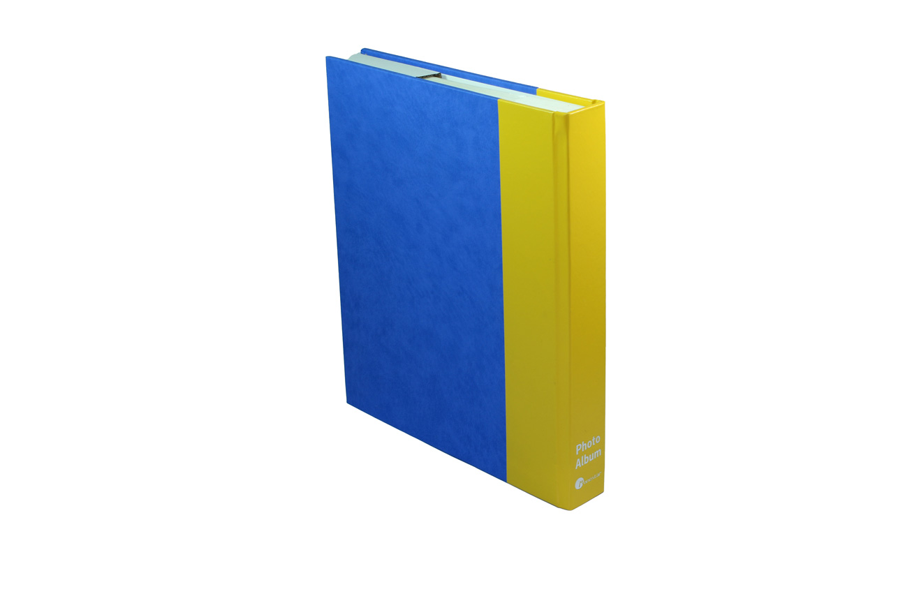
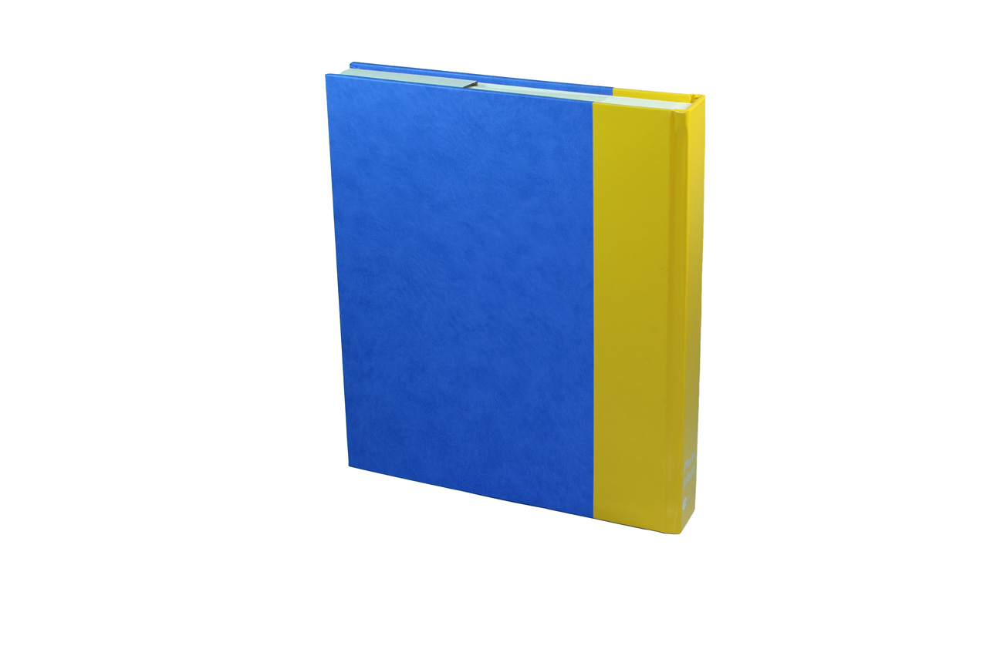
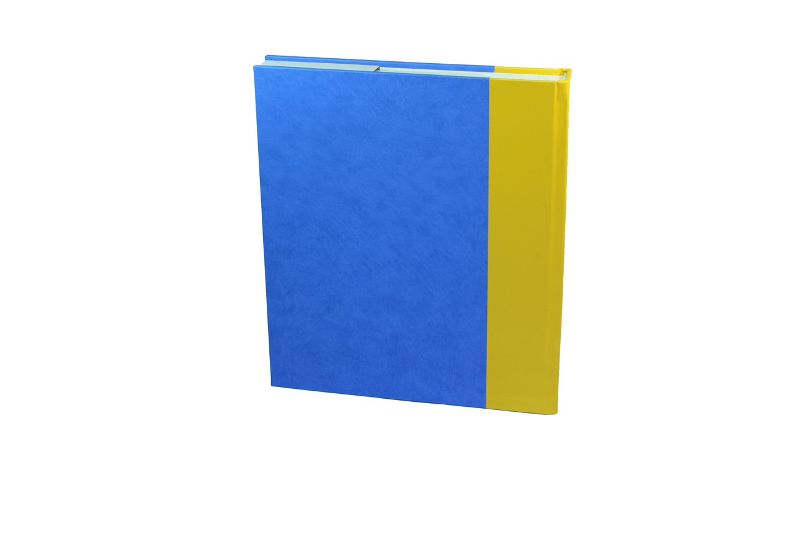
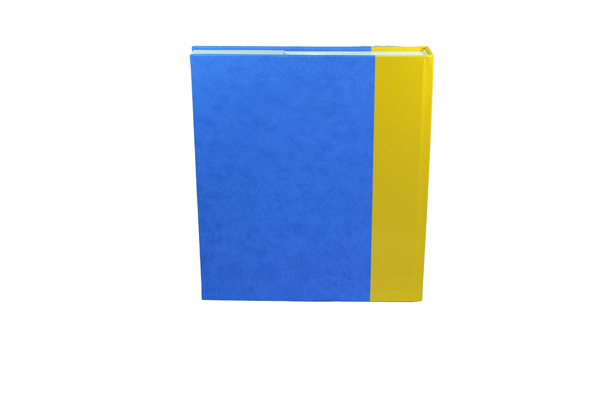
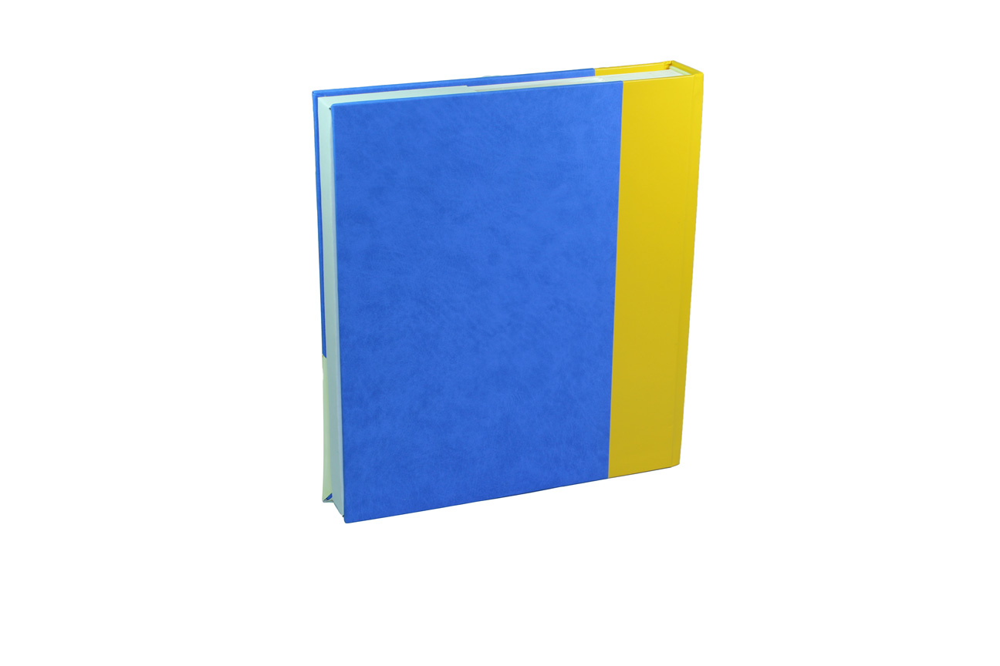
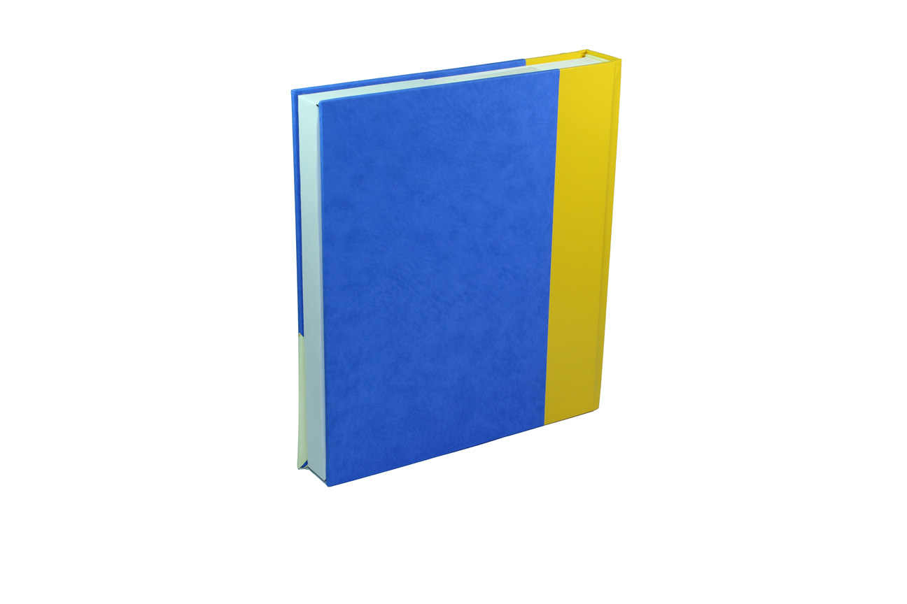
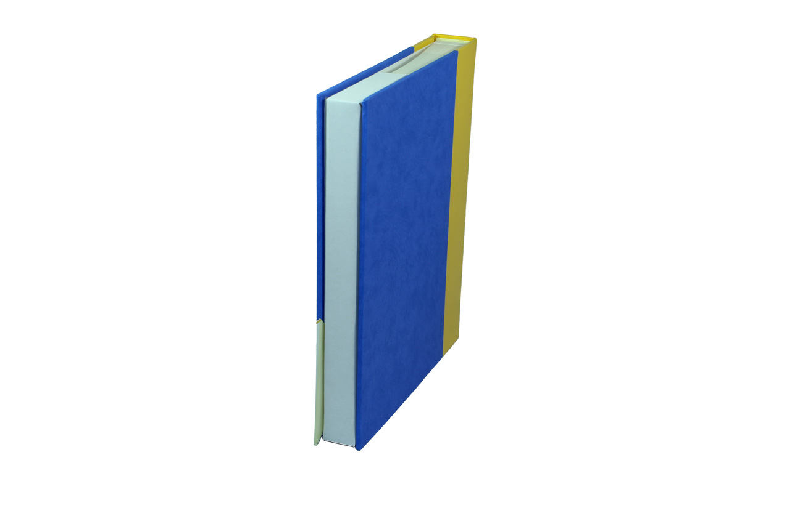

# jquery.gallerize - Demo

To begin, you will be required to import the latest version of jQuery onto your site. Then call jquery.gallerize.min.js, jquery.gallerize.min.css and the desired theme (Default, Light, Dark & Midnight) css file such as jquery.gallerize-midnight.min.css.

```markdown
<script src="https://code.jquery.com/jquery-2.2.4.min.js"></script>
<script src="js/jquery.gallerize.min.js"></script>
<link href="css/jquery.gallerize.min.css" rel="stylesheet" />
<link href="css/jquery.gallerize-default.min.css" rel="stylesheet" />
```


## Basic 360 Product Image

```markdown

## HTML
<div class="container">
  <div class="gallerize">
    <ul>
      <li class="g360pi">
        <ul>
          <li></li>
          <li></li>
          <li></li>
          <li></li>
          <li></li>
          <li></li>
          <li></li>
          <li></li>
          <li></li>
          <li></li>
          <li></li>
          <li></li>
          <li></li>
          <li></li>
          <li></li>
          <li></li>
          <li></li>
          <li></li>
          <li></li>
          <li></li>
          <li></li>
          <li></li>
          <li></li>
          <li></li>
          <li></li>
          <li></li>
          <li></li>
          <li></li>
          <li></li>
          <li></li>
          <li></li>
        </ul>
      </li>
    </ul>
  </div>
</div>


## JS
<script type="text/javascript">
  $('.gallerize').gallerize({
    gBGColour: 'white',
    threeSixPiLoop: 'forever',
    threeSixPiDelay: 100,
    pauseSP: 8000,
    transSP: 2500,
    thumbHeight: 35,
    thumbWidth: 35
  });
</script>

```
